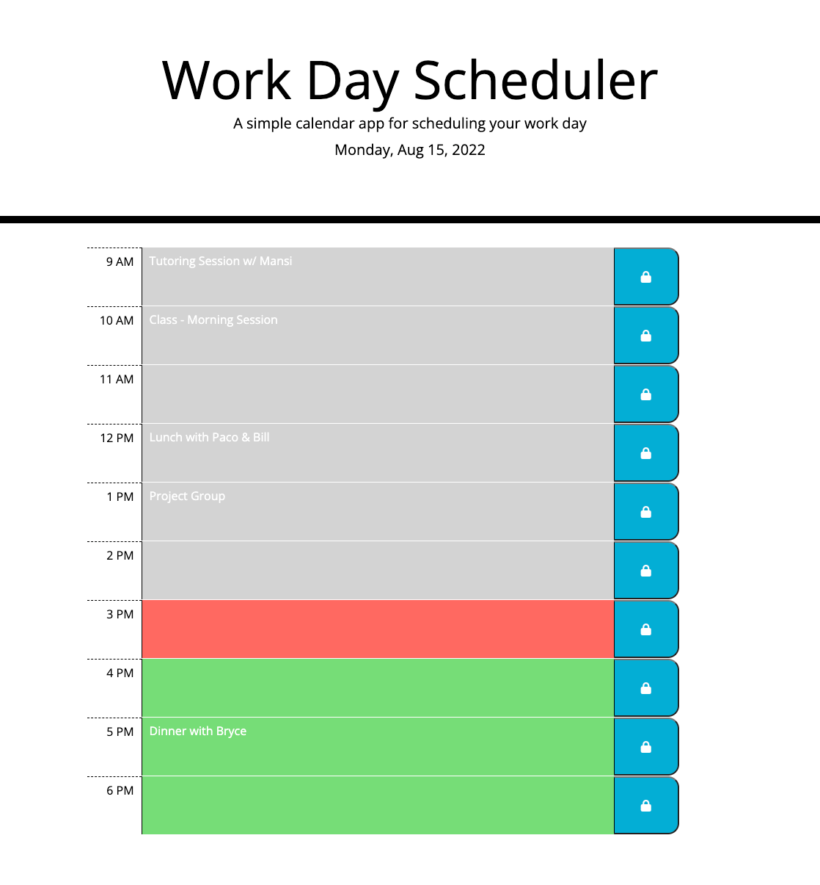

# daily-schedule-tracker-app

## About

This is a calendar scheduling application designed to allow a user to save events for each hour of the day. The schedule tracker dynamically displays the date at the top of the page. It shows timeblocks for standard business hours. The timeblocks color-code depending on if they are past, present, or future.

When a user clicks into a timeblock, they can enter text. When they click the lock button for that timeblock, the text is saved in local storage. On refresh, saved events populate the schedule.

## Screenshot

## Deployed Application Link
